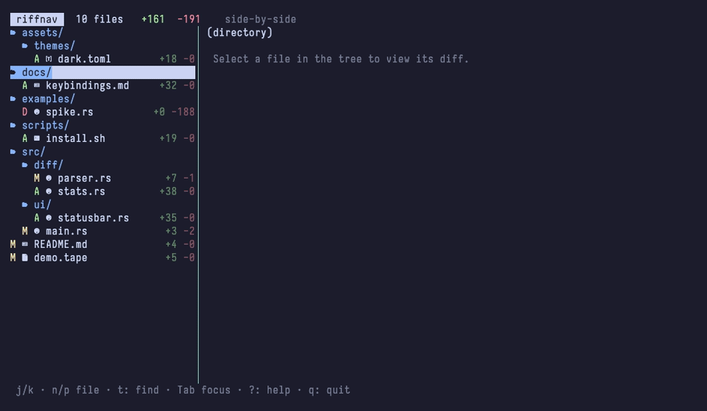

# riffnav

A git diff pager with a GitHub-style file tree, powered by [delta][delta].

> 🤖 **Built with AI.** riffnav — its code, tests, and docs — was written with AI assistance

`riffnav` reads a unified diff on stdin, renders each file with `delta`, and wraps
it in a terminal UI: a navigable file tree on the left, the rendered diff on the
right. It's a Rust take on [diffnav][diffnav].



## Requirements

- **[delta][delta]** on your `PATH` — riffnav renders diffs with it.
- A **[Nerd Font][nerdfonts]** for filetype icons (optional). No Nerd Font? Press
  `i` to cycle to `unicode` or `ascii` icons, or set `icon_style` in the config.

## Install

With the Rust toolchain (`cargo`):

```sh
# From a local checkout:
cargo install --path .

# Or straight from the repository:
cargo install --git https://github.com/ollipa/riffnav
```

This puts the `riffnav` binary in `~/.cargo/bin` (make sure that's on your `PATH`).

## Usage

Pipe any unified diff into it:

```sh
git diff | riffnav
git diff HEAD~3 | riffnav
git show <commit> | riffnav
```

Or run it bare inside a repo to diff the current branch automatically — see
[Run without a piped diff](#run-without-a-piped-diff).

### Use it as git's pager

```sh
git config --global pager.diff riffnav
git config --global pager.show riffnav
```

Now `git diff` and `git show` open in riffnav. (Setting `core.pager` also works,
but scoping to `diff`/`show` avoids sending `git log` through it.)

By default riffnav follows your `delta.side-by-side` git setting; force a layout
for one run with `-s` (side-by-side) or `-u` (unified).

## Keybindings

| Key | Action |
|-----|--------|
| `j` / `k` (or `↑` / `↓`) | Move selection (tree) / move the line cursor (diff), per focus |
| `n` / `p` (or `N`) | Next / previous file |
| `Ctrl-d` / `Ctrl-u` | Scroll diff half a page |
| `PgDn` / `PgUp` | Page down / up (scroll diff or move tree, per focus) |
| `g` / `G` | Top / bottom of the diff |
| `Enter` / `Space` | Expand / collapse the selected folder |
| `Tab` | Switch focus between tree and diff |
| `t` / `/` | Fuzzy-find a file |
| `s` | Toggle side-by-side / unified |
| `e` | Toggle the file tree |
| `i` | Cycle icon style (nerd → unicode → ascii) |
| `T` | Cycle diff theme (delta → github-dark → github-light) |
| `y` | Copy the selected file's path |
| `v` / `V` | Mark the file viewed / jump to the next unviewed file |
| `d` | Cycle the diff source — uncommitted → staged → unstaged → branch-vs-base (only on a [bare launch](#run-without-a-piped-diff)) |
| `r` | Re-read the diff, picking up changes made since (bare launch or watch mode) |
| `o` | Open the selected file in `$EDITOR` |
| `c` | [Comment](#review-comments) on the cursor's line, or reply when it's inside a thread |
| `x` | Delete the comment under the cursor, and its replies |
| `]` / `[` | Jump to the next / previous comment |
| `z` | Toggle zoom on riffnav's pane (only inside [herdr](#herdr-integration)) |
| `?` | Toggle the help overlay |
| `q` / `Esc` / `Ctrl-c` | Quit |

## Configuration

riffnav reads `$XDG_CONFIG_HOME/riffnav/config.toml` (or
`~/.config/riffnav/config.toml`); override with `--config <FILE>`. Every key is
optional. Settings resolve as **defaults < config file < CLI flags**.

```toml
# ~/.config/riffnav/config.toml
# side_by_side = false   # omit to follow your delta.side-by-side default
icon_style   = "nerd"    # nerd | unicode | ascii
diff_theme   = "github-dark" # github-dark | github-light | delta (inherit gitconfig)
tree_width   = 32        # columns for the file-tree pane
show_tree    = true
start_focus  = "diff"    # "diff": open in the first file (n/p between files) | "tree"
show_header  = true
show_footer  = true
open_depth   = 64        # expand folders shallower than this on launch
review_retention_days = 90 # days to keep "viewed" marks before GC
review_auto_advance = true # jump to next unviewed file after marking viewed
review_sync_github = false # push "viewed" marks to the matching GitHub PR (needs `gh`)
# base_branch = "main"     # base for "branch vs base"; omit to auto-detect
# diff_source = "all"      # bare-launch view: all|committed|staged|unstaged (omit = adaptive)
```

See [`config.example.toml`](config.example.toml) for the annotated version.

## Reviewing changes

Press `v` to mark the selected file **viewed** — it gets a green `✓` and dims in
the tree — and `V` to jump to the next unviewed file. Marking viewed also
advances to the next unviewed file by default (`review_auto_advance`), so review
flows file-to-file. The header shows your progress (`✓ 3/8 viewed`).

Viewed marks persist across runs, scoped per repository **and** branch (like
GitHub's per-PR "Viewed" checkbox), and are keyed on the *content* of each
change: edit a file you'd marked viewed and it reverts to unviewed automatically,
just as GitHub un-ticks a file the author pushes to. State lives under
`$XDG_STATE_HOME/riffnav/viewed/` and is garbage-collected by age
(`review_retention_days`, default 90). Outside a git repo (e.g. an arbitrary diff
piped in) marking still works for the session but isn't persisted.

## Review comments

Leave notes on a line of the diff, and read notes an AI agent left for you.

Press `c` to comment on the line under the cursor. A field opens right where the
note will live — type into it, `Ctrl-S` to save, `Esc` to discard. It takes the
usual editing keys (`Enter` for a new line, `Ctrl-W` / `Ctrl-U` to rub out a word
or the line, `Ctrl-A` / `Ctrl-E` for its ends), and `Ctrl-O` moves what you've
typed into `$EDITOR` when a note outgrows the field — a git-commit-style buffer,
where you type above the scissors line and save empty to abort.

Press `c` inside an existing thread — where `]` / `[` leave the cursor — and it
replies to the comment you're on instead; there's no separate reply key. `x`
deletes the comment under the cursor along with the replies beneath it. Saved
notes are drawn as a box under the line they annotate, with each reply on a
divider inside it. Files carrying comments show a `💬` count in the tree.

### Letting an agent comment

The `riffnav comment` subcommands are the agent-facing half. They're ordinary
non-interactive commands that read and write the same store the running window
watches — so a note written in another terminal appears on screen within a
moment, and works just as well with no window open.

```sh
riffnav comment context                # files and the line ranges you can anchor to
riffnav comment add --file src/app.rs --new-line 103 --body "No backoff here."
riffnav comment list --json            # read back what the user wrote
```

Point your agent at the bundled skill, which teaches it the above:

```sh
riffnav skill            # print it
riffnav skill --path     # write it out and print the path
```

Anchors are validated before anything is written: naming a file that isn't in
the diff, or a line outside every hunk, fails with the ranges that *would* have
worked. Several notes at once go through one batch, which is validated whole so
a typo can't half-apply:

```sh
printf '%s' '{"comments":[
  {"file":"src/app.rs","newLine":103,"body":"No backoff here."},
  {"file":"README.md","newLine":12,"body":"Stale: the flag is now --diff."}
]}' | riffnav comment apply --stdin
```

There's no daemon and no port — just a JSON file under
`$XDG_STATE_HOME/riffnav/comments/`, scoped per repository and branch like
viewed marks, and garbage-collected by age (`comment_retention_days`). A comment
whose code has changed since it was written is flagged rather than silently
sliding onto a different line.

## Run without a piped diff

Launch `riffnav` bare — no diff on stdin, not watch mode — inside a git repo and
it diffs the repo for you. By default it shows your **uncommitted** changes
(staged, unstaged, and untracked files); when the working tree is clean it falls
back to what your **branch adds over its base** (`git diff <base>...HEAD`, like a
PR diff).

```sh
riffnav            # in a repo: uncommitted changes, or branch-vs-base if clean
riffnav --diff committed   # force the branch-vs-base (PR) view
riffnav --base develop     # compare against a specific base branch
```

Press `r` to re-read the diff — commits, stages, and edits made since you opened
riffnav show up, without losing your place in the file you're reading. Press `d`
to cycle what's shown:

- **all uncommitted** — staged + unstaged + untracked
- **staged** — `git diff --staged`
- **unstaged** — `git diff`
- **branch vs base** — `git diff <base>...HEAD`

The base branch is auto-detected from `origin/HEAD` and a local `main`/`master`,
picking whichever branched off your current branch more recently — so commits
you already merged into a local `main` aren't counted as your branch's work. Set
it explicitly with `--base <ref>` or the `base_branch` config key.
Choose the starting view with `--diff <all|committed|staged|unstaged>` or the
`diff_source` config key. Piping a diff in (or `--watch`) behaves exactly as
before — the bare launch is just an extra entry point.

## Watch mode

`-w` / `--watch` keeps riffnav open and refreshes when your working tree changes —
handy on a second monitor while you edit.

```sh
riffnav --watch                       # re-runs `git diff` on change
riffnav --watch --watch-cmd "git diff --staged"
riffnav --watch --watch-interval 1    # also poll every second
```

In watch mode the diff is produced by `--watch-cmd` (default `git diff`), not
stdin. Changes are detected by a filesystem watcher (debounced) plus the polling
interval as a safety net; the view only rebuilds when the diff actually changes,
and your selected file is preserved across refreshes. `r` runs the command
immediately, for a change the watcher can't see.

## herdr integration

When riffnav runs inside [herdr](https://herdr.dev) (detected via `HERDR_ENV=1`),
the `z` key toggles **zoom** on riffnav's pane — maximizing it to fill the window,
or restoring it. riffnav talks to herdr's [socket API][herdr-socket] over its Unix
control socket (found via `HERDR_SOCKET_PATH` / `HERDR_SESSION`, or the default
session socket). Outside herdr the key does nothing and isn't shown in the footer
or help.

## How it works

stdin → split per file (`diff --git`) → build the tree → on selection, run the
file's hunk through `delta` (cached per file/width/layout) and convert its ANSI
output to styled text with [ansi-to-tui][ansi-to-tui], drawn with
[ratatui][ratatui]. Because stdin is the diff, key input is read from `/dev/tty`.

Comments anchor to a *diff line*, never a screen row, so they stay put across a
resize, a theme switch, or a unified/side-by-side toggle. riffnav recovers those
line numbers by pinning delta's line-number gutter to a fixed-width format and
reading it back out of the rendered output — which is why line numbers are always
on.

## License

MIT

[delta]: https://github.com/dandavison/delta
[diffnav]: https://github.com/dlvhdr/diffnav
[nerdfonts]: https://www.nerdfonts.com/
[ratatui]: https://ratatui.rs/
[ansi-to-tui]: https://github.com/ratatui/ansi-to-tui
[herdr-socket]: https://herdr.dev/docs/socket-api/
